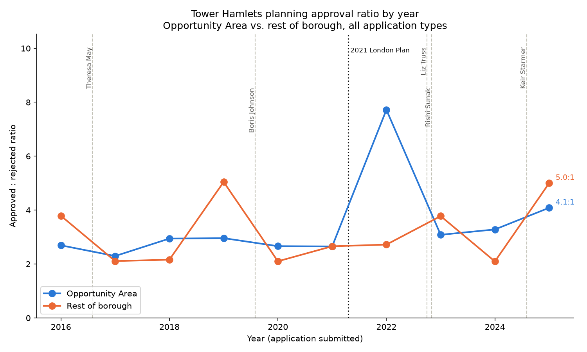

# London Opportunity Area planning approvals

An interactive map of every London borough and adopted ("red status")
[Opportunity Area](https://apps.london.gov.uk/opportunity-areas/) showing its
planning-application approval rate: approved (Permitted + Conditions) vs.
rejected, for decided applications. A year-range filter lets you restrict
this to applications submitted between 2016 and 2026.

**[Open the map](https://wwstorymode.github.io/oa-planning-map/)** — a single
self-contained HTML file, no server required. All boundary data and approval
statistics are precomputed and embedded in the page.

Built for **[House London #0 | Data Hackathon](https://luma.com/160gn1gj)**
(Newspeak House, 1 August 2026) by Christine, Sharuga, and William —
**[open the presentation deck](https://wwstorymode.github.io/oa-planning-map/presentation/opportunity-by-the-numbers.html)**.

## How it works

This is a precompute-then-render pipeline, not a live app — there is no
backend and no database access at view time.

```
scripts/build_area_lookups.py   ── postcode -> borough / postcode -> Opportunity Area
                                    lookups + boundary GeoJSON, from ONSPD + two
                                    live GLA/London Datastore ArcGIS services
                                              │
scripts/build_stats.py          ── one batch query against a local planning-
                                    applications sqlite export, joined against
                                    the lookups above, aggregated per area
                                    AND per submission year (2016-2026)
                                              │
scripts/build_site.py           ── renders site/london_planning_map.html,
                                    embedding the boundaries + stats inline
```

### Package layout

- `src/london_oa/` — shared logic, reused by every script:
  - `constants.py` — coordinate systems, GSS codes, GIS service URLs
  - `arcgis.py` — `fetch_adopted_oas()`, `fetch_borough_boundaries()`
  - `postcodes.py` — ONSPD loading, postcode normalization
  - `applications.py` — sqlite query + approved/rejected/excluded classification
  - `pm_terms.py` — UK Prime Minister tenure date ranges + lookup, used by
    `scripts/build_pm_stats.py`
- `scripts/` — pipeline entry points (see above) plus a few Tower Hamlets-specific
  examples (`collect_oa_postcodes.py`, `oa_approval_rate.py`, `plot_city_fringe_map.py`)
  that predate the London-wide pipeline and are kept as smaller, single-area
  worked examples of the same package.
- `site/` — the generated static map (committed).
- `data/` — `area_stats.json` and the two boundary GeoJSONs are small, derived,
  Open Government Licence data, so they're committed too. Everything else
  under `data/` (raw downloads, the large per-postcode lookup CSVs) is
  gitignored — see `data/README.md`.

## Setup

```
python3 -m venv .venv
.venv/bin/pip install -e .
```

## Reproducing the pipeline

1. Get the raw inputs — see `data/README.md` for exactly what's needed and where it goes.
2. Run the pipeline in order:
   ```
   .venv/bin/python3 scripts/build_area_lookups.py data/raw/ONSPD_FEB_2026/Data/ONSPD_FEB_2026_UK.csv
   .venv/bin/python3 scripts/build_stats.py --db ~/Downloads/housing_planning.sqlite
   .venv/bin/python3 scripts/build_site.py
   ```
3. Open `site/london_planning_map.html` in a browser.

Re-run `build_stats.py` + `build_site.py` any time the underlying sqlite
export is refreshed; re-run `build_area_lookups.py` too if the ONSPD data or
the Opportunity Area boundaries change.

## Year filter

The sidebar's "Applications submitted [from] to [to]" control filters by
`start_date` (application submission year), not `decided_date`. `start_date`
has zero nulls and cleanly spans 2016–2026 across the whole dataset (2026 is
a partial year); `decided_date` has ~7.7% nulls (undecided/withdrawn
applications never got one) plus a handful of pre-2016 outliers, which would
otherwise silently drop those rows from every range. `build_stats.py`
precomputes raw counts per area *and year*; the browser sums whatever range
is selected and derives the rate/ratio client-side (`aggregateStats()` in
`scripts/build_site.py`) — still no backend, no live DB access.

## Known limitation: uneven data coverage by borough

The planning-applications source data covers boroughs very unevenly — total
matched applications range from ~50 (Camden) to ~32,700 (Barnet), a ~650x
spread. This looks like uneven scrape coverage per council in the underlying
PlanIt-derived export, not a real difference in application volume.

Two consequences worth knowing about:

- **Small-sample boroughs** (roughly under 500 applications — Camden, City of
  London, Westminster, Hackney, Hillingdon, Hammersmith and Fulham, Haringey)
  have approval rates that can swing a lot from a handful of applications.
- **Havering shows a 100% approval rate** (0 rejected out of 1,687 matched
  applications). I checked the raw sqlite export directly (bypassing this
  repo's postcode-join logic entirely) and confirmed every application
  logged under `area_name = 'Havering'` has `app_state` in
  `{Permitted, Conditions, Undecided, Withdrawn}` — there is no `Rejected`
  value anywhere for that council in this dataset. That's a gap in what was
  scraped, not a genuine 100% approval rate.

`site/london_planning_map.html` shows an in-page warning for both cases (a
"small sample" note under ~500 total applications, and a distinct "no
rejected/approved applications recorded" note when one side of the
approved/rejected split is exactly zero) — see the `coverageWarning()`
function in `scripts/build_site.py`.

## Prime Minister / Opportunity Area analysis



**Sharuga** put together an initial analysis asking whether Tower Hamlets'
approval pattern tracks the Prime Minister/government over the years — her
original write-up, data, and chart are archived at
[`analysis/contributed/sharuga-pm-opportunity-summary/`](analysis/contributed/sharuga-pm-opportunity-summary/).
Her headline finding: no distinct pattern by government, but a clear overall
lean toward approval (~3.6:1 permitted:rejected), slightly higher inside
Opportunity Areas than outside.

`scripts/build_pm_stats.py` reproduces the same question on this repo's full
dataset (all application types, not just her narrower "additional buildings/
renovations" subset — see her README for why the totals differ) — same
conclusion: no consistent pattern tied to any one government, an approval
lean across the whole period (Opportunity Area 3.18:1, rest of borough
2.83:1 overall for 2016–2026), and a fair amount of year-to-year noise
(the 2022 Opportunity Area spike is real in the data, not a chart artifact —
see [`data/tower_hamlets_pm_opportunity_summary.csv`](data/tower_hamlets_pm_opportunity_summary.csv)
for the row-level counts behind it). Regenerate both the CSV and the chart
with:

```
.venv/bin/python3 scripts/build_pm_stats.py \
    --nspl data/raw/ONSPD_FEB_2026/Data/ONSPD_FEB_2026_UK.csv \
    --db ~/Downloads/housing_planning.sqlite
```

## References

- [House London #0 | Data Hackathon](https://luma.com/160gn1gj) — Newspeak
  House, 1 August 2026, where this project was built.
- [Opportunity Areas Map](https://apps.london.gov.uk/opportunity-areas/) —
  the GLA's live Opportunity Area boundary map (visual only, no downloadable
  postcode list — see "The Challenge" in the presentation deck).
- [London Plan Opportunity Areas | London Datastore](https://data.london.gov.uk/dataset/london-plan-opportunity-areas-2jxjl)
- [ONS Postcode Directory (February 2026) for the UK | Open Geography Portal](https://geoportal.statistics.gov.uk/datasets/3080229224424c9cb53c0b48f5a64d27/about)

## Data sources & licensing

- Postcode geography: [ONS Postcode Directory (ONSPD)](https://geoportal.statistics.gov.uk/datasets/3080229224424c9cb53c0b48f5a64d27/about),
  Office for National Statistics, Open Government Licence.
- Opportunity Area boundaries: Greater London Authority, via the live service
  behind [apps.london.gov.uk/opportunity-areas](https://apps.london.gov.uk/opportunity-areas/)
  (see also the [London Datastore dataset page](https://data.london.gov.uk/dataset/london-plan-opportunity-areas-2jxjl)),
  Open Government Licence.
- Borough boundaries: London Datastore "Statistical GIS Boundary Files for
  London" (`London_Borough_Excluding_MHW`), Open Government Licence.
- Planning applications: a local sqlite export derived from
  [PlanIt](https://www.planit.org.uk/) scraped data. **Not included in this
  repo** — only aggregated per-area counts computed from it
  (`data/area_stats.json`, `data/tower_hamlets_pm_opportunity_summary.csv`)
  are committed, never the underlying application-level records.

## License

TODO — not yet chosen.
